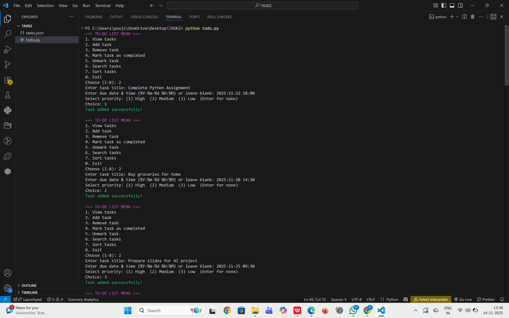
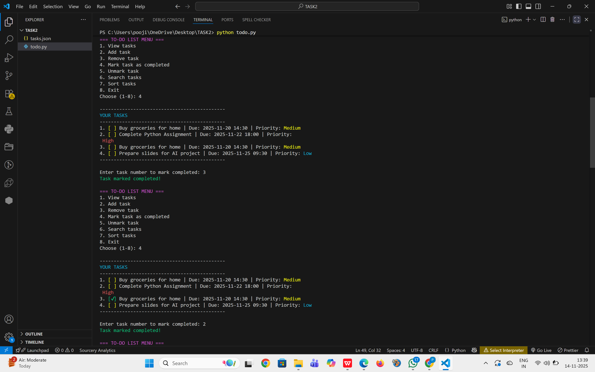
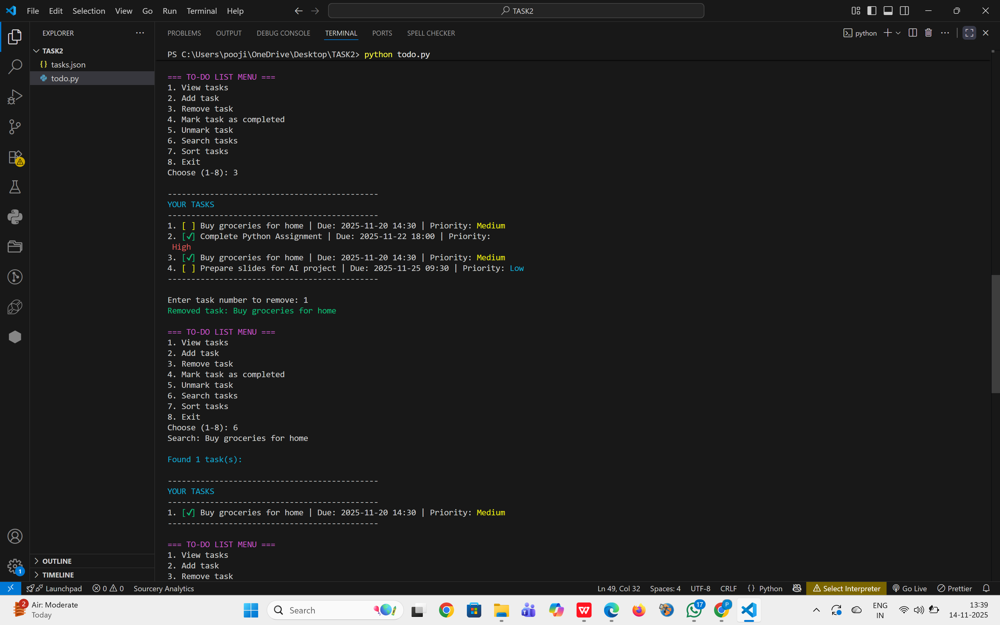
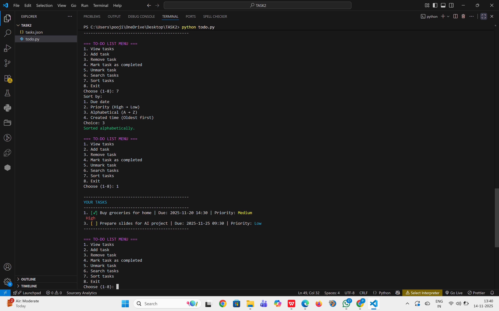

# 📌 Console-Based To-Do List Application (Python)

A simple yet powerful **Command-Line To-Do List Manager** built using Python.  
This application lets you add tasks, set priorities, mark tasks as completed, search tasks, sort them, and store everything permanently in a JSON file — with colorful terminal output using Colorama.

---

## 🚀 Features

### ✔ Add Tasks  
Create tasks with:
- Title  
- Due Date & Time  
- Priority (High / Medium / Low / None)

### ✔ Mark / Unmark  
- Mark tasks as completed  
- Unmark tasks to set them back to pending  

### ✔ Due Date & Time Format  
YYYY-MM-DD HH:MM

### ✔ Priority Levels  
- High  
- Medium  
- Low  
- None  

### ✔ Search Tasks  
Search tasks by keywords.

### ✔ Sorting Options  
Sort by:
1. Due Date  
2. Priority (High → Low)  
3. Alphabetical (A → Z)  
4. Created Time  

### ✔ Colorful Output  
Using Colorama:
- 🟢 Green — success  
- 🔴 Red — errors  
- 🟡 Yellow — warnings  
- 🔵 Cyan — highlights  

### ✔ Persistent Storage  
All tasks are saved in `tasks.json` automatically.

---

## 📁 Project Structure

TASK2/
├── todo.py
├── tasks.json
├── OUTPUT-1.png
├── OUTPUT-2.png
├── OUTPUT-3.png
├── OUTPUT-4.png
└── README.md

---

## 🛠 Tech Stack

- Python 3.x  
- Colorama (for colored output)  
- JSON (for storing tasks)

---

🎮 Usage Example

When you run the app, you will see:
=== TO-DO LIST MENU ===
1. View tasks
2. Add task
3. Remove task
4. Mark task as completed
5. Unmark task
6. Search tasks
7. Sort tasks
8. Exit

## 🖥 Sample Program Output (Screenshots)

Below are the actual screenshots of the To-Do List Application running in the terminal:

### 📌 Output 1 — Adding Tasks

### 📌 Output 2 — Marking Tasks as Completed

### 📌 Output 3 — Removing & Searching Tasks

### 📌 Output 4 — Sorting & Viewing Final Tasks

🌟 Future Enhancements

Add categories (work, study, personal)

Add notifications

Export tasks to CSV or PDF

Add GUI version using Tkinter

Build a web version using Flask

⭐ Support

If you like this project, please ⭐ star the repository on GitHub!

